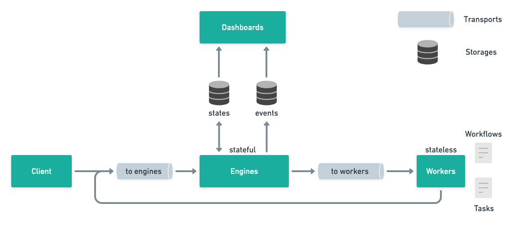

# Infinitic

> Infinitic is still a work in progress, please contact us if you are interested

## What is it?

Infinitic is a general purpose framework to build automation. It can be used to orchestrate microservices, to manage distributed transactions, to operate data pipelines, to build user-facing automation, etc.

Infinitic provides:

* a convenient way to describe how to compose your jobs/tasks into workflows, using a "workflow as code"pattern. Each workflow is described by a Kotlin class, included in your versioning system.
* an engine able to process those files/classes to ensure your tasks are processed in the exact order defined by the workflow, even in case of failures, even in a distributed environment. This engine is able to interpret classes describing your workflows, and automatically stores its state, to be able to resume after any failure.
* a dashboard to monitor everything and resume errors.

We hope that by using Infinitic you should spare literally months of developers time.

It has been thought from start to be pluggable to any infrastructure with some adaptation works. We will support initially a version pluggable to Apache Pulsar(see [why](https://medium.com/@gillesbarbier/building-an-event-driven-orchestration-engine-bf62d45aef5d?source=friends_link&sk=22528e7580f94f5835e760ad3556c16f)).

## Architecture

Infinitic provides implementations for:

* **Client**: mostly use to dispatch workflows
* **Engines**: maintain states of workflows and tasks
* **Workers**: they are processing tasks:
  * regular tasks whose you provide implementation
  * `WorkflowTask` who are special tasks whose implementation is provided by Infinitic, and are used to determine what to do next based on history and definition of a workflow.
*  **Dashboards**.

Those elements are linked together through:

- **Transports**: to transport messages we provide into an [avro](http://avro.apache.org/docs/current/) format that guarantees data integrity and evolutivity. Those transport layers should guarantee resilience and fault-tolerance.
- **Storages**: we recommend 2 types of storage :
  - a key-value one for storing states (mostly used by engines)
  - an append-only document storage for storing events (only used by dashboards)

> messages and storages can be implemented based on your technology choices.  Currently, we provide an implementation based on Apache Pulsar.

## Introduction

Infinitic implements a "workflow as code" pattern. It let you implement basically any type of workflows, as you benefit from the versatility of a programmation language.

> Currently, we support kotlin for workflow definition. You can use different programming language for your tasks.

For example, let's consider a situation when  I need to create different versions of a picture at different sizes after a user uploads it and then save the urls relating to the user profile. I can do that with the following workflow:

- *line 4*: the interface defines how to use ImageUtil. Here we have 4 methods (`download`, `crop`, `upload, ` `save`) defined with their parameter types (a unique String for `download` for example).
- *line 11*: our class extends interface `io.infinitic.common.workflows.Workflow`, giving access to `proxy` and `async` functions used below.
- *line 12*: `context` is injected when processing by a Worker. It contains the workflow history.
- *line 13*: `proxy` function provides a pseudo-instance of the provided `ImageTask`  interface. *Line 17*, a method is being applied to this pseudo instance - this pseudo-instance will see that we want to process the method `download` for the distributed task `ImageUtil` with data `imageUrl`: if the history stored in `context` does NOT show that this task is already completed then the execution stops here, and a command will be sent to the workflow engine to will trigger the `ImageUtil` task on `download` method with `imageUrl` data. If this task is already completed, the pseudo-instance returns the result, and the workflow continues its execution.
- *lines 50, 23, 27*: `async` function can be used to tell the workflow engine that we start an asynchronous branch. Here 3 branches are open in parallel and tasks. The output of an `async` function is a `Deferred<T>` where T is the return type of the result when completed.
- *line 32*: the `and` infix function creates a new `Deferred<List<String>>`. Using `context`, the `result()` method will check if all branches above are completed. If yes, then `result()` returns the result of the all completed Deferred. If not, a command will be sent to the workflow engine to tell it to wait for completion of all those `Deferred` before triggering a new `WorkflowTask`.
- *line 34*: we reach this line only after completion of previous branch. We then trigger a new task `ImageTask::save` with data `email` and `list`.
- *line 35*: once the end reached, the workflow is now completed.

> Note: `async`, `Deferred`, `await` exists in kotlin with a different meaning. They have been used here as they represent similar concepts, but they are not the same functions. Actually, it's forbidden in workflow's definition to use any real asynchronous functions.

Being able to define workflow as code provides you with a very flexible and powerful tool. For example, instead of the 3 sizes for your image cropping, you can decide to crop your image from 10 to 200 pixels just with a few lines changes:

## Getting Started

Please subscribe here if interested
